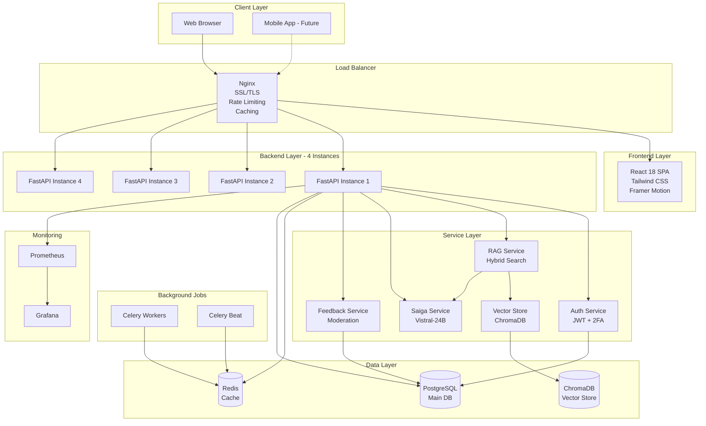
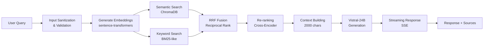
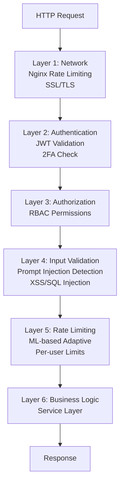
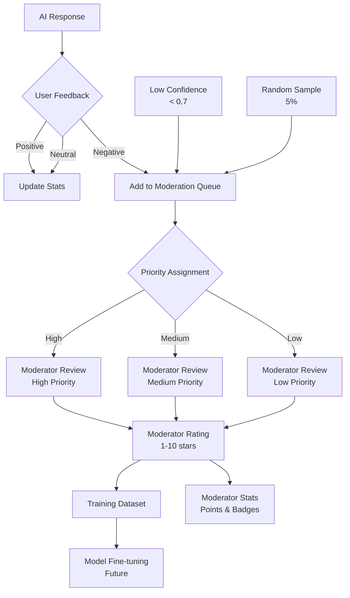
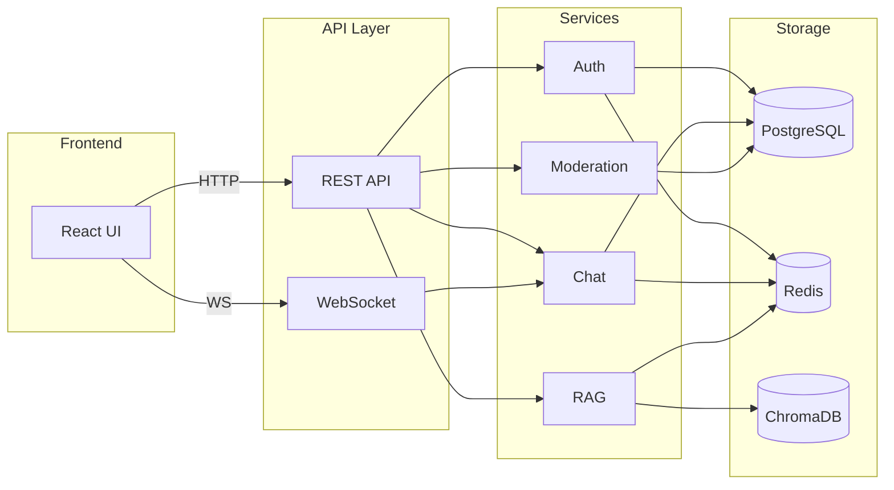

# 🏗️ АРХИТЕКТУРНАЯ ДИАГРАММА A2CODEX

## Общая архитектура системы

```mermaid
graph TB
    subgraph "Client Layer"
        Browser[Web Browser]
        Mobile[Mobile App - Future]
    end
    
    subgraph "Load Balancer"
        Nginx[Nginx<br/>SSL/TLS<br/>Rate Limiting<br/>Caching]
    end
    
    subgraph "Frontend Layer"
        React[React 18 SPA<br/>Tailwind CSS<br/>Framer Motion]
    end
    
    subgraph "Backend Layer - 4 Instances"
        API1[FastAPI Instance 1]
        API2[FastAPI Instance 2]
        API3[FastAPI Instance 3]
        API4[FastAPI Instance 4]
    end
    
    subgraph "Service Layer"
        Auth[Auth Service<br/>JWT + 2FA]
        RAG[RAG Service<br/>Hybrid Search]
        LLM[Saiga Service<br/>Vistral-24B]
        Feedback[Feedback Service<br/>Moderation]
        Vector[Vector Store<br/>ChromaDB]
    end
    
    subgraph "Data Layer"
        Postgres[(PostgreSQL<br/>Main DB)]
        Redis[(Redis<br/>Cache)]
        Chroma[(ChromaDB<br/>Vector Store)]
    end
    
    subgraph "Background Jobs"
        Celery[Celery Workers]
        Beat[Celery Beat]
    end
    
    subgraph "Monitoring"
        Prometheus[Prometheus]
        Grafana[Grafana]
    end
    
    Browser --> Nginx
    Mobile -.-> Nginx
    Nginx --> React
    Nginx --> API1
    Nginx --> API2
    Nginx --> API3
    Nginx --> API4
    
    API1 --> Auth
    API1 --> RAG
    API1 --> LLM
    API1 --> Feedback
    
    RAG --> Vector
    RAG --> LLM
    Vector --> Chroma
    
    Auth --> Postgres
    Feedback --> Postgres
    
    API1 --> Redis
    API1 --> Postgres
    
    Celery --> Redis
    Beat --> Redis
    
    API1 --> Prometheus
    Prometheus --> Grafana
```

## RAG Pipeline Architecture

```mermaid
graph LR
    Query[User Query] --> Sanitize[Input Sanitization<br/>& Validation]
    Sanitize --> Embed[Generate Embeddings<br/>sentence-transformers]
    
    Embed --> Semantic[Semantic Search<br/>ChromaDB]
    Embed --> Keyword[Keyword Search<br/>BM25-like]
    
    Semantic --> RRF[RRF Fusion<br/>Reciprocal Rank]
    Keyword --> RRF
    
    RRF --> Rerank[Re-ranking<br/>Cross-Encoder]
    Rerank --> Context[Context Building<br/>2000 chars]
    
    Context --> LLM[Vistral-24B<br/>Generation]
    LLM --> Stream[Streaming Response<br/>SSE]
    
    Stream --> Response[Response + Sources]
```

## Security Layers

```mermaid
graph TD
    Request[HTTP Request] --> L1[Layer 1: Network<br/>Nginx Rate Limiting<br/>SSL/TLS]
    L1 --> L2[Layer 2: Authentication<br/>JWT Validation<br/>2FA Check]
    L2 --> L3[Layer 3: Authorization<br/>RBAC Permissions]
    L3 --> L4[Layer 4: Input Validation<br/>Prompt Injection Detection<br/>XSS/SQL Injection]
    L4 --> L5[Layer 5: Rate Limiting<br/>ML-based Adaptive<br/>Per-user Limits]
    L5 --> L6[Layer 6: Business Logic<br/>Service Layer]
    L6 --> Response[Response]
```

## Feedback & Moderation Flow

```mermaid
graph TD
    AIResponse[AI Response] --> UserFeedback{User Feedback}
    
    UserFeedback -->|Positive| Stats[Update Stats]
    UserFeedback -->|Negative| Queue[Add to Moderation Queue]
    UserFeedback -->|Neutral| Stats
    
    LowConfidence[Low Confidence<br/>< 0.7] --> Queue
    RandomSample[Random Sample<br/>5%] --> Queue
    
    Queue --> Priority{Priority Assignment}
    Priority -->|High| ModHigh[Moderator Review<br/>High Priority]
    Priority -->|Medium| ModMed[Moderator Review<br/>Medium Priority]
    Priority -->|Low| ModLow[Moderator Review<br/>Low Priority]
    
    ModHigh --> Review[Moderator Rating<br/>1-10 stars]
    ModMed --> Review
    ModLow --> Review
    
    Review --> Dataset[Training Dataset]
    Dataset --> FineTune[Model Fine-tuning<br/>Future]
    
    Review --> ModStats[Moderator Stats<br/>Points & Badges]
```

## Data Flow

```mermaid
graph LR
    subgraph "Frontend"
        UI[React UI]
    end
    
    subgraph "API Layer"
        REST[REST API]
        WS[WebSocket]
    end
    
    subgraph "Services"
        Auth[Auth]
        Chat[Chat]
        RAG[RAG]
        Mod[Moderation]
    end
    
    subgraph "Storage"
        PG[(PostgreSQL)]
        RD[(Redis)]
        CH[(ChromaDB)]
    end
    
    UI -->|HTTP| REST
    UI -->|WS| WS
    
    REST --> Auth
    REST --> Chat
    REST --> RAG
    REST --> Mod
    
    WS --> Chat
    
    Auth --> PG
    Auth --> RD
    
    Chat --> PG
    Chat --> RD
    
    RAG --> CH
    RAG --> RD
    
    Mod --> PG
```

