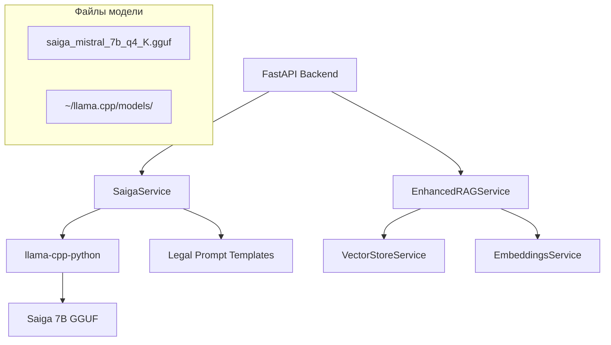
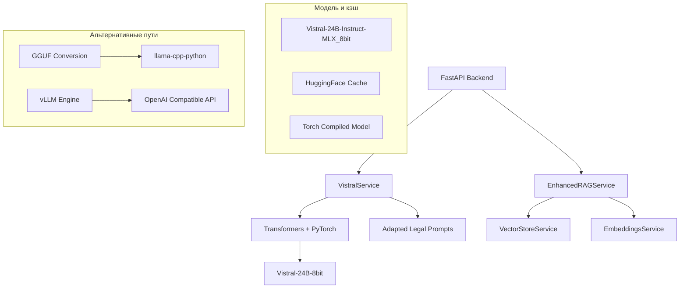

# Проектирование миграции на модель Vistral-24B-Instruct

## Обзор

Данный документ описывает архитектурное решение для миграции AI-юридической системы с модели Saiga Mistral 7B (llama-cpp-python) на модель Vistral-24B-Instruct-MLX_8bit. Учитывая ограничения MLX фреймворка на x86_64 архитектуре, проект предусматривает использование альтернативных решений.

## Архитектура

### Текущая архитектура (до миграции)



### Целевая архитектура (после миграции)



## Компоненты и интерфейсы

### 1. VistralService (замена SaigaService)

**Интерфейс:**
```python
class VistralService:
    async def generate_response_async(
        self, 
        prompt: str, 
        max_tokens: int = 1024,
        temperature: float = 0.3,
        top_p: float = 0.8
    ) -> str
    
    async def stream_response(
        self,
        prompt: str,
        max_tokens: int = 1024,
        temperature: float = 0.3,
        top_p: float = 0.8
    ) -> AsyncGenerator[str, None]
    
    def create_legal_prompt(
        self, 
        question: str, 
        context: Optional[str] = None
    ) -> str
    
    def is_model_loaded(self) -> bool
    def get_stats(self) -> dict
```

**Реализация:**
- Использует transformers + torch для загрузки модели
- Поддерживает 8-bit квантизацию через bitsandbytes
- Реализует torch.compile для ускорения
- Кэширует модель в памяти с оптимизацией

### 2. Адаптер конфигурации

**Новые настройки:**
```python
# Vistral Model Configuration
VISTRAL_MODEL_NAME: str = "Vikhrmodels/Vistral-24B-Instruct-MLX_8bit"
VISTRAL_DEVICE: str = "auto"  # auto, cpu, cuda
VISTRAL_LOAD_IN_8BIT: bool = True
VISTRAL_MAX_MEMORY: dict = {"": "14GB"}  # Ограничение памяти
VISTRAL_TORCH_DTYPE: str = "float16"
VISTRAL_TRUST_REMOTE_CODE: bool = True

# Generation Parameters
VISTRAL_MAX_NEW_TOKENS: int = 2048
VISTRAL_TEMPERATURE: float = 0.2
VISTRAL_TOP_P: float = 0.9
VISTRAL_DO_SAMPLE: bool = True
VISTRAL_PAD_TOKEN_ID: int = None  # Будет определен автоматически
```

### 3. Система промптов

**Адаптированный формат промптов:**

Vistral использует ChatML формат или Alpaca. Необходимо адаптировать:

```python
def create_vistral_legal_prompt(question: str, context: str = None) -> str:
    system_prompt = """Ты - опытный юрист-консультант по российскому законодательству. 
    Отвечай максимально подробно, точно и профессионально на русском языке.
    
    КРИТИЧЕСКИ ВАЖНО:
    - Используй только реально существующие законы РФ
    - Указывай точные номера статей
    - Не выдумывай сроки и процедуры
    - Если не знаешь - честно скажи "уточните в компетентных органах"
    """
    
    # ChatML формат для Vistral
    if context:
        prompt = f"""<|im_start|>system
{system_prompt}

Дополнительный контекст:
{context}<|im_end|>
<|im_start|>user
{question}<|im_end|>
<|im_start|>assistant
"""
    else:
        prompt = f"""<|im_start|>system
{system_prompt}<|im_end|>
<|im_start|>user
{question}<|im_end|>
<|im_start|>assistant
"""
    
    return prompt
```

### 4. Менеджер ресурсов

**Оптимизация памяти:**
```python
class VistralResourceManager:
    def __init__(self):
        self.max_memory = "14GB"  # Резерв 2GB для системы
        self.device_map = "auto"
        self.load_in_8bit = True
    
    def get_model_config(self) -> dict:
        return {
            "device_map": self.device_map,
            "load_in_8bit": self.load_in_8bit,
            "max_memory": {0: self.max_memory},
            "torch_dtype": torch.float16,
            "trust_remote_code": True
        }
    
    def monitor_memory_usage(self) -> dict:
        # Мониторинг использования памяти
        pass
```

## Модели данных

### 1. Конфигурация модели

```python
@dataclass
class VistralConfig:
    model_name: str
    device: str
    load_in_8bit: bool
    max_memory: Dict[str, str]
    torch_dtype: str
    trust_remote_code: bool
    
    # Generation parameters
    max_new_tokens: int
    temperature: float
    top_p: float
    do_sample: bool
    pad_token_id: Optional[int]
```

### 2. Статистика производительности

```python
@dataclass
class VistralStats:
    total_requests: int
    successful_requests: int
    failed_requests: int
    average_response_time: float
    memory_usage: float
    model_load_time: float
    cache_hits: int
```

## Обработка ошибок

### 1. Стратегии обработки ошибок

**Недостаток памяти:**
```python
class MemoryError(Exception):
    def __init__(self, required_memory: str, available_memory: str):
        self.required_memory = required_memory
        self.available_memory = available_memory
        super().__init__(f"Insufficient memory: required {required_memory}, available {available_memory}")

# Обработка
try:
    model = load_vistral_model()
except MemoryError as e:
    logger.error(f"Memory error: {e}")
    # Fallback to smaller model or GGUF conversion
    model = load_fallback_model()
```

**Ошибки загрузки модели:**
```python
class ModelLoadError(Exception):
    pass

# Каскадная загрузка
def load_model_with_fallback():
    try:
        return load_vistral_transformers()
    except ModelLoadError:
        try:
            return load_vistral_gguf()
        except ModelLoadError:
            return load_mock_service()
```

### 2. Система мониторинга

```python
class VistralHealthChecker:
    def check_model_health(self) -> dict:
        return {
            "model_loaded": self.is_model_loaded(),
            "memory_usage": self.get_memory_usage(),
            "last_response_time": self.get_last_response_time(),
            "error_rate": self.get_error_rate()
        }
    
    def check_system_resources(self) -> dict:
        return {
            "available_memory": self.get_available_memory(),
            "cpu_usage": self.get_cpu_usage(),
            "disk_space": self.get_disk_space()
        }
```

## Стратегия тестирования

### 1. Модульные тесты

```python
class TestVistralService:
    async def test_generate_response(self):
        service = VistralService()
        response = await service.generate_response_async("Что такое договор?")
        assert len(response) > 100
        assert "договор" in response.lower()
    
    async def test_legal_prompt_format(self):
        service = VistralService()
        prompt = service.create_legal_prompt("Статья 105 УК РФ")
        assert "<|im_start|>" in prompt
        assert "юрист-консультант" in prompt
```

### 2. Интеграционные тесты

```python
class TestVistralIntegration:
    async def test_rag_integration(self):
        # Тест интеграции с RAG системой
        rag_service = EnhancedRAGService()
        response = await rag_service.search_legal_documents("мошенничество")
        assert response.confidence > 0.7
    
    async def test_api_compatibility(self):
        # Тест совместимости API
        client = TestClient(app)
        response = client.post("/api/v1/chat/legal", json={
            "question": "Как зарегистрировать ИП?"
        })
        assert response.status_code == 200
```

### 3. Нагрузочные тесты

```python
class TestVistralPerformance:
    async def test_concurrent_requests(self):
        # Тест параллельных запросов
        tasks = []
        for i in range(10):
            task = asyncio.create_task(
                vistral_service.generate_response_async(f"Вопрос {i}")
            )
            tasks.append(task)
        
        results = await asyncio.gather(*tasks)
        assert len(results) == 10
        assert all(len(r) > 50 for r in results)
    
    def test_memory_usage(self):
        # Тест использования памяти
        initial_memory = get_memory_usage()
        for i in range(100):
            response = vistral_service.generate_response_sync("Тест")
        final_memory = get_memory_usage()
        
        # Проверяем, что нет утечек памяти
        assert final_memory - initial_memory < 1024  # MB
```

## План развертывания

### 1. Подготовительный этап

1. **Резервное копирование:**
   - Создать полный бэкап текущей системы
   - Сохранить конфигурацию Saiga
   - Экспортировать базу данных

2. **Анализ ресурсов:**
   - Проверить доступную память (16 ГБ)
   - Оценить дисковое пространство (160 ГБ)
   - Тестировать сетевое подключение к HuggingFace

### 2. Этап миграции

1. **Удаление старых компонентов:**
   ```bash
   # Удаление файлов модели Saiga
   rm -rf ~/llama.cpp/models/saiga_*.gguf
   
   # Удаление зависимостей
   pip uninstall llama-cpp-python
   
   # Очистка конфигурации
   sed -i '/SAIGA_/d' backend/.env
   ```

2. **Установка новых зависимостей:**
   ```bash
   # Установка transformers и зависимостей
   pip install transformers torch bitsandbytes accelerate
   
   # Установка дополнительных пакетов
   pip install sentencepiece protobuf
   ```

3. **Развертывание нового сервиса:**
   ```bash
   # Копирование нового кода
   cp vistral_service.py backend/app/services/
   
   # Обновление конфигурации
   echo "VISTRAL_MODEL_NAME=Vikhrmodels/Vistral-24B-Instruct-MLX_8bit" >> backend/.env
   ```

### 3. Этап тестирования

1. **Функциональное тестирование:**
   - Проверка загрузки модели
   - Тест генерации ответов
   - Проверка интеграции с RAG

2. **Производительное тестирование:**
   - Измерение времени ответа
   - Тест использования памяти
   - Нагрузочное тестирование

### 4. Этап продакшена

1. **Мониторинг:**
   - Настройка алертов на использование памяти
   - Мониторинг времени ответа
   - Отслеживание ошибок

2. **Оптимизация:**
   - Настройка torch.compile
   - Оптимизация параметров генерации
   - Кэширование часто используемых промптов

## Альтернативные решения

### 1. GGUF конверсия

Если transformers не подходит по производительности:

```python
# Конверсия Vistral в GGUF формат
def convert_vistral_to_gguf():
    # Использование llama.cpp convert.py
    subprocess.run([
        "python", "convert.py", 
        "--model", "Vikhrmodels/Vistral-24B-Instruct-MLX_8bit",
        "--outfile", "vistral-24b-q4_k_m.gguf",
        "--outtype", "q4_k_m"
    ])
```

### 2. vLLM интеграция

Для высокой производительности:

```python
from vllm import LLM, SamplingParams

class VistralVLLMService:
    def __init__(self):
        self.llm = LLM(
            model="Vikhrmodels/Vistral-24B-Instruct-MLX_8bit",
            quantization="bitsandbytes",
            load_format="bitsandbytes",
            max_model_len=4096
        )
    
    async def generate_response_async(self, prompt: str) -> str:
        sampling_params = SamplingParams(
            temperature=0.2,
            top_p=0.9,
            max_tokens=1024
        )
        
        outputs = self.llm.generate([prompt], sampling_params)
        return outputs[0].outputs[0].text
```

### 3. Облачное решение

Если локальные ресурсы недостаточны:

```python
class VistralCloudService:
    def __init__(self):
        self.api_key = os.getenv("HUGGINGFACE_API_KEY")
        self.endpoint = "https://api-inference.huggingface.co/models/Vikhrmodels/Vistral-24B-Instruct-MLX_8bit"
    
    async def generate_response_async(self, prompt: str) -> str:
        async with httpx.AsyncClient() as client:
            response = await client.post(
                self.endpoint,
                headers={"Authorization": f"Bearer {self.api_key}"},
                json={"inputs": prompt, "parameters": {"max_new_tokens": 1024}}
            )
            return response.json()[0]["generated_text"]
```

## Риски и митигация

### 1. Технические риски

**Риск:** Недостаток памяти для модели 24B
**Митигация:** 
- Использование 8-bit квантизации
- Настройка max_memory
- Fallback на GGUF конверсию

**Риск:** Низкая производительность на CPU
**Митигация:**
- Использование torch.compile
- Оптимизация batch size
- Кэширование результатов

### 2. Операционные риски

**Риск:** Длительное время загрузки модели
**Митигация:**
- Предзагрузка модели при старте
- Использование model caching
- Warm-up процедуры

**Риск:** Нестабильность сервиса
**Митигация:**
- Comprehensive health checks
- Автоматический restart при ошибках
- Fallback на mock service

## Метрики успеха

1. **Производительность:**
   - Время ответа < 30 секунд
   - Использование памяти < 14 ГБ
   - Uptime > 99%

2. **Качество:**
   - Релевантность ответов >= текущего уровня
   - Точность юридической информации
   - Пользовательская удовлетворенность

3. **Стабильность:**
   - Error rate < 1%
   - Успешная загрузка модели в 100% случаев
   - Отсутствие memory leaks